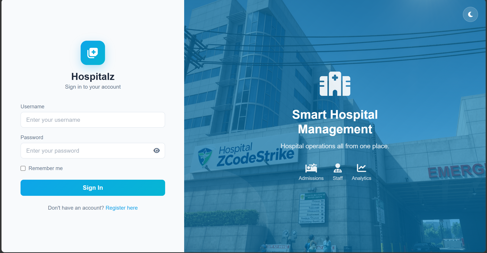
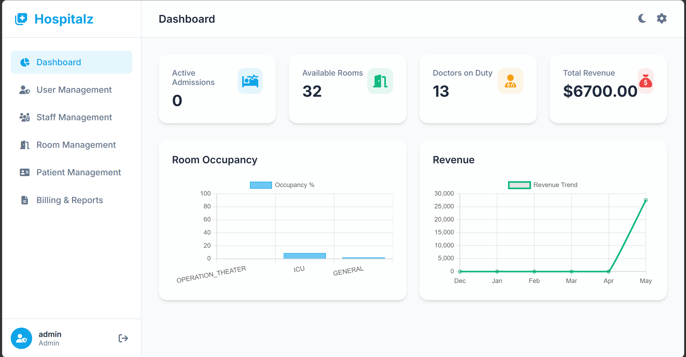
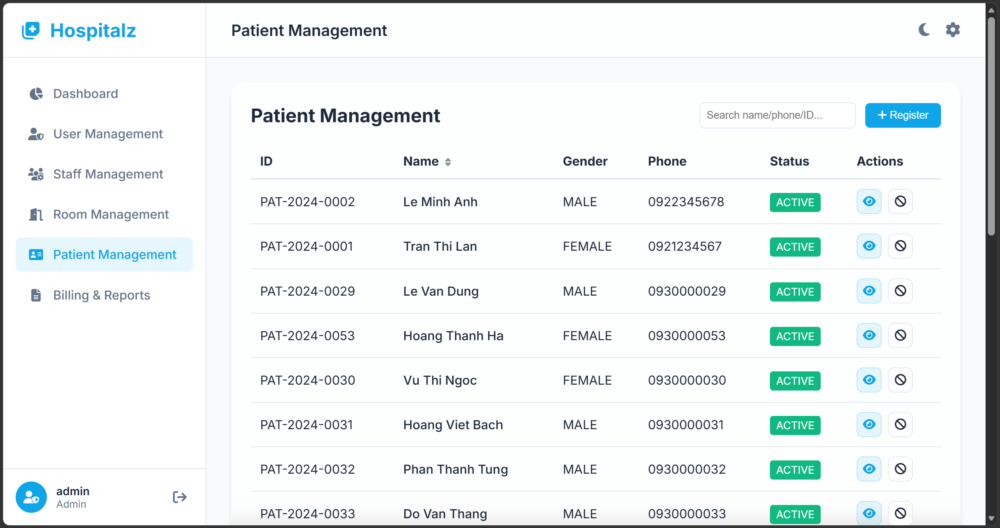
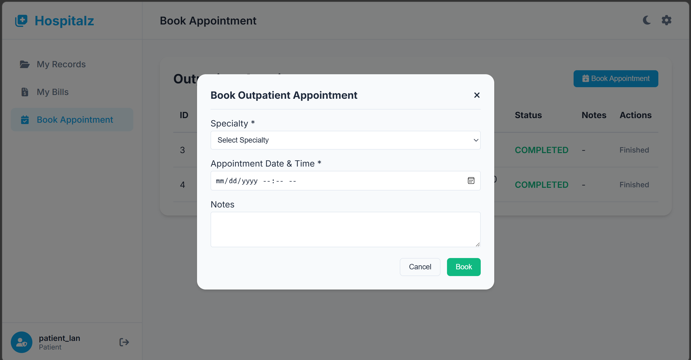
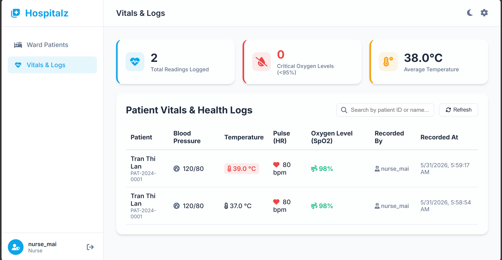
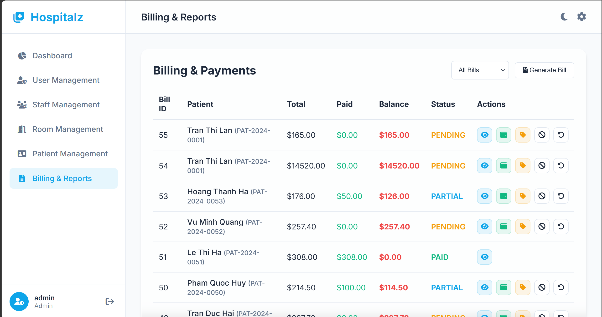

<div align="center">

# Hospital Management System

**A full-stack web application for managing core hospital operations**  
Built with Spring Boot 3, Spring Security 6, JWT authentication, and Vanilla JavaScript.

</div>

---

## Table of Contents

1. [Project Description](#-project-description)
2. [Team Members & Roles](#-team-members--roles)
3. [Technology Stack](#-technology-stack)
4. [Prerequisites](#-prerequisites)
5. [Setup Instructions](#-setup-instructions)
6. [Environment Variables](#-environment-variables)
7. [Running Locally](#-running-locally)
8. [Running Tests](#-running-tests)
9. [Known Issues & Limitations](#-known-issues--limitations)
10. [Live Demo](#-live-demo)
11. [Test Account Credentials](#-test-account-credentials)
12. [Screenshots](#-screenshots)

---

## Project Description

**Hospital Management System** digitalises and streamlines core hospital workflows including:

- Patient registration, record management, and status tracking
- Appointment scheduling and doctor–patient assignment
- Room and admission management with full discharge workflow
- Treatment plans, treatment records, and vitals monitoring (BP, temperature, pulse, SpO₂)
- Billing, payment management, and invoice generation
- Staff management (Nurses, Ward Boys) with shift and ward assignment
- Transport task coordination
- Admin dashboard with system-wide statistics

The system uses **stateless JWT-based authentication** with role-based access control across five distinct user roles.

---

## Team Members & Roles

| Name | Role | Responsibilities |
|------|------|-----------------|
| *Nguyễn Thế Khoa* | Team Lead & Backend | Backend: Spring Boot controllers, services, security, billing logic, PDF generation. |
| *Phạm Song Gia Khánh* | Frontend Developer | Frontend: HTML, CSS, JavaScript, dashboard charts, UI consistency. |
| *Nguyễn Hưng* | Backend Developer | Integration, SQL queries, seed data, documentation, testing coordination, database design. |
| *Trần Đình Hưng* | Backend Developer | Testing, bug tracking, error handling and validation improvements, UI polish, and deployment setup. |

---

## Technology Stack

| Layer | Technology | Version |
|-------|-----------|---------|
| Language | Java | 21 |
| Framework | Spring Boot | 3.x |
| Security | Spring Security | 6.x |
| Authentication | JWT (io.jsonwebtoken / jjwt) | HS256 |
| Password Hashing | BCryptPasswordEncoder | Strength 10 |
| ORM | Spring Data JPA + Hibernate | — |
| Database | MySQL | 8.0 |
| Build Tool | Apache Maven | 3.9.15 |
| Frontend | HTML5 + CSS3 + Vanilla JavaScript | SPA (no framework) |
| Deployment | Railway | — |

---

## Prerequisites

Before running this project, ensure you have the following installed:

| Tool | Minimum Version | Download |
|------|----------------|----------|
| Java JDK | 21 | https://adoptium.net |
| Apache Maven | 3.9+ | https://maven.apache.org |
| MySQL Server | 8.0+ | https://dev.mysql.com/downloads |
| Git | Any | https://git-scm.com |

---

## Setup Instructions

### Step 1 — Clone the repository

```bash
git clone https://github.com/CodeStrike/CodeStrike-Hospital_Management.git
cd CodeStrike-Hospital_Management/hospitalz
```

### Step 2 — Create the MySQL database

```sql
CREATE DATABASE hospital_db CHARACTER SET utf8mb4 COLLATE utf8mb4_0900_ai_ci;
```

### Step 3 — Import the schema and seed data

```bash
mysql -u root -p hospital_db < database/schema.sql
```

This imports all tables and pre-populates test data including users, patients, doctors, rooms, staff, appointments, and bills.

### Step 4 — Configure your local database connection

Create a local properties file (already in `.gitignore`):

```bash
cp src/main/resources/application.properties \
   src/main/resources/application-local.properties
```

Then edit `application-local.properties`:

```properties
spring.datasource.url=jdbc:mysql://localhost:3306/hospital_db?serverTimezone=UTC
spring.datasource.username=root
spring.datasource.password=YOUR_MYSQL_PASSWORD
jwt.secret=YOUR_256BIT_BASE64_SECRET
```

### Step 5 — Build the project

```bash
./mvnw clean install -DskipTests
```

---

## Environment Variables

| Variable | Default Value | Required | Description |
|----------|--------------|----------|-------------|
| `DB_URL` | `jdbc:mysql://localhost:3306/hospital_db?serverTimezone=UTC` | ✅ | MySQL JDBC connection URL |
| `DB_USERNAME` | `root` | ✅ | Database username |
| `DB_PASSWORD` | `NfbJikjeVwYPaDdRcOqGvvVSLLVoKAPS` | ✅ | Database password |
| `JWT_SECRET` | `404E635266556A586E3272357538782F413F4428472B4B6250645367566B5970` | ✅ | Base64-encoded 256-bit HS256 signing key |


---

##  Running Locally

### Using Maven Wrapper

```bash
cd hospitalz
./mvnw spring-boot:run
```

### Using environment variables (recommended for production)

```bash
DB_URL=jdbc:mysql://localhost:3306/hospital_db?serverTimezone=UTC \
DB_USERNAME=root \
DB_PASSWORD=yourpassword \
JWT_SECRET=yoursecretkey \
./mvnw spring-boot:run
```

### Access the application

Once started, open your browser at:

```
http://localhost:8080
```

You will be redirected to the login page at `/auth.html`.

---

##  Running Tests

### Run all tests

```bash
./mvnw test
```

### Run a specific test class

```bash
./mvnw test -Dtest=BCryptExample
```

### Manual API testing with curl

**Login:**
```bash
curl -X POST http://localhost:8080/api/v1/auth/login \
  -H "Content-Type: application/json" \
  -d '{"username": "admin_system", "password": "Admin@123", "rememberMe": false}'
```

**Access protected endpoint:**
```bash
curl http://localhost:8080/api/v1/patients \
  -H "Authorization: Bearer YOUR_JWT_TOKEN"
```

---

## Known Issues & Limitations

| # | Issue | Impact | Workaround |
|---|-------|--------|------------|
| 1 | No automated unit/integration test suite | Low test coverage | Manual testing via curl or browser |
| 2 | `ddl-auto=update` enabled in dev | Risk of schema drift in prod | Switch to `validate` before deploying to production |
| 3 | JWT has no server-side revocation | Logout only clears client storage; token remains valid until expiry | Acceptable for academic scope; production would need a token blacklist |
| 4 | No pagination on large list endpoints | Slow response on large datasets | Planned for future iteration |
| 5 | Frontend is a single-file SPA | No build step, but large JS files | Acceptable for current scope |
| 6 | Railway free-tier database may sleep | Cold start delay ~5–10s on first request | Wait briefly after first load |

---

##  Live Demo

>  **Demo URL:**(https://codestrike-hospitalmanagement.up.railway.app/auth.html)


---

##  Test Account Credentials

The following accounts are pre-seeded in `database/schema.sql` for testing:

| Role | Username | Password | Access Level |
|------|----------|----------|-------------|
| **Admin** | `admin` | `pass` | Full system access, user & staff management |
| **Receptionist** | `receptionist` | `pass` |
| **Doctor** | `dr_an` | `pass` | Patients, appointments, treatments |
| **Nurse** | `nurse_mai` | `pass` | Vitals recording, assigned ward |
| **Ward Boy** | `wardboy_hoa` | `pass` | Transport task management |
| **Patient** | `patient_lan` | `pass` | Own appointments, records, bills |

---

## 📸 Screenshots


### Login Page


### Admin Dashboard


### Patient Management


### Appointment Scheduling


### Vitals Monitoring


### Billing


---

<div align="center">

**CodeStrike Team** · Hospital Management System · 2024

</div>
